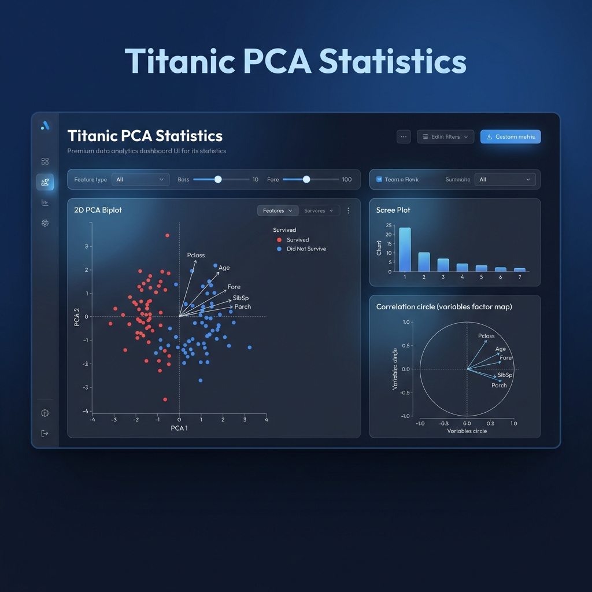

# PCA Excellence: Titanic & FactoMineR Ecosystem 🚢📊



[](https://www.python.org/)
[](https://streamlit.io/)
[](http://factominer.free.fr/)

Este ecosistema profesional implementa la metodología de **Análisis de Componentes Principales (PCA)** siguiendo el estándar de oro de **FactoMineR** (R), trasladado a entornos de producción modernos con **Python** y **Streamlit**.

---

## 🌟 Lo más destacado

### 🚢 Reporte Avanzado Titanic (Premium)
Ubicado en `Visualizaciones/Dashboard_Reporte_Titanic.py`, este es el buque insignia del proyecto:
- **Análisis Factorial 360°**: Círculo de correlación, Scree Plots y Biplots avanzados.
- **Pestaña de Dataset Intuitiva**: Exploración de datos crudos con glosario bilingüe e indicadores de salud de datos.
- **Interpretación Pedagógica**: Conclusiones dinámicas que cambian según los filtros aplicados.
- **Estética Sapphire**: Diseño corporativo azul oscuro optimizado para presentaciones académicas y empresariales.

---

## 📂 Arquitectura del Proyecto

El repositorio ha sido organizado para mantener un flujo de trabajo profesional y limpio:

```bash
FactoMineR/
├── 📁 Visualizaciones/        # Dashboards interactivos (Streamlit)
│   ├── Dashboard_Reporte_Titanic.py  <-- [RECOMENDADO]
│   ├── Dashboard_Titanic_PCA.py      # Versión ligera
│   └── 03_Dashboard_PCA.py           # Dashboard Decathlon
├── 📁 imagenes/               # Resultados gráficos autogenerados (.png)
├── 📄 Analisis_Titanic.py     # Script de análisis puro del Titanic
├── 📄 02_PCA_FactoMineR_style.py # Replicación paso a paso de R a Python
└── 📄 README.md               # Documentación principal
```

---

## 🚀 Guía de Inicio Rápido

### 1. Instalación de Dependencias
Asegúrate de tener todas las herramientas necesarias instaladas:

```bash
pip install pandas numpy matplotlib seaborn prince openpyxl requests streamlit plotly
```

### 2. Ejecutar el Reporte Avanzado (Visual)
Para lanzar el dashboard interactivo del Titanic:

```bash
streamlit run Visualizaciones/Dashboard_Reporte_Titanic.py
```

### 3. Ejecutar Análisis Estadístico (Terminal)
Si prefieres generar los reportes y las imágenes estáticas:

```bash
python Analisis_Titanic.py
```

---

## 🔍 Metodología Aplicada

Este proyecto aplica rigurosamente la metodología de:
*   **Husson, F., Le, S., & Pages, J. (2017)**. _Exploratory Multivariate Analysis by Example Using R_. 
*   **Reducción de Dimensionalidad**: Capturando la máxima varianza con individuos y variables suplementarias.
*   **Métricas de Calidad**: Análisis profundo de **Cos2** y **Contribuciones** para una interpretación veraz.

---

## ✍️ Autoría y Créditos

Este trabajo es el resultado del desarrollo técnico y estadístico de:

**💎 Daniel Alexis Mendoza Corne**
*   **Profesor/Referencia**: Juan Marcelo Gutiérrez Miranda (@TodoEconometria)
*   **Propósito**: Educación y análisis avanzado de datos.

---
*Este proyecto está configurado para la versión 2026 de Streamlit, libre de advertencias y optimizado para alto rendimiento.*
